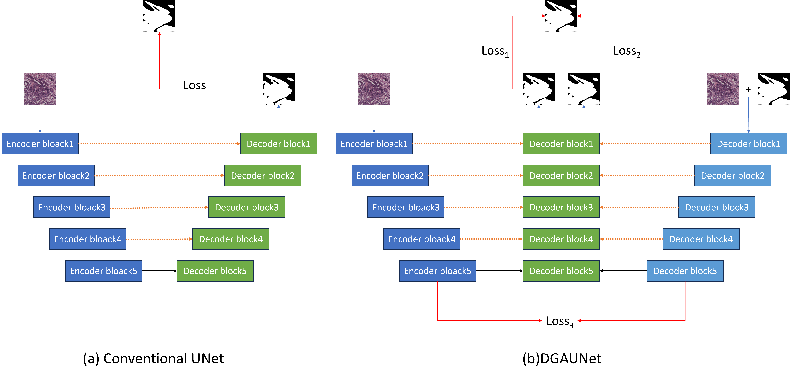
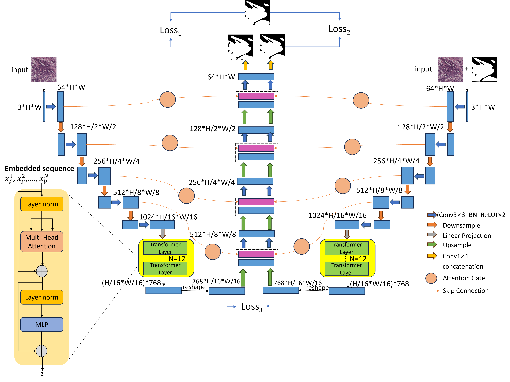
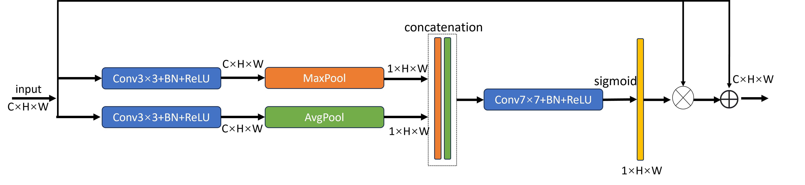

# DGAUNet dual-stream mask guided attention U-Net
The paper ["Towards Gastric Cancer Pathological Segmentation: A Large-Scale Whole-Slide Image Dataset and Dual-Stream Mask-Guided Attention U-Net"](https://www.sciencedirect.com/science/article/abs/pii/S1746809425009097) has been published.

Conceptual architectures comparisons between DGAUNet and conventional UNet:

DGAUNet：

The proposed attention gate for the connections between encoder and decoder：

# Environments
* Python 3.9
* Pytorch 2.2.1
* GPU RTX2080Ti
# Datasets
```
├── data
    ├── GCPS
        ├── images
        |       ├── 0
        |           ├── 1.png
        |           ├── 2.png
        |           ├── ...
        |
        ├── masks
        |       ├── 0
        |           ├── 1.png
        |           ├── 2.png
        |           ├── ...
        |
├── src
├── train.py
├── split.py
├── ...
```
# Training
```
python DGAUNet_train.py --base_dir ./data/GCPS --train_file_dir GCPS_train.txt --val_file_dir GCPS_val.txt --base_lr 0.01 --epoch 150 --batch_size 8
```

[You can also download pre-trained models here](https://drive.google.com/file/d/1ZQG1xyhSDFzOGvRwYggFMuNc9Z4qfydd/view?usp=drive_link)

# Contact
If you use our code, please cite our paper:
```
@article{ZHANG2026108398,
title = {Towards gastric cancer pathological segmentation: A large-scale whole-slide images dataset and dual-stream mask guided attention U-net},
journal = {Biomedical Signal Processing and Control},
volume = {111},
pages = {108398},
year = {2026},
issn = {1746-8094},
doi = {https://doi.org/10.1016/j.bspc.2025.108398},
url = {https://www.sciencedirect.com/science/article/pii/S1746809425009097},
author = {Qinghua Zhang and Jiani Xiong and Yangqiang Wang and Tian-jian Luo and Wei Gao and Yucai Lin},
keywords = {Gastric cancer segmentation, Dual-stream mask guided attention, U-Net, Medical image dataset, Clinical applicable study},
abstract = {Gastric cancer is one of the common malignancies of the digestive tract. With the rapid development of computer-assisted pathological image segmentation, deep learning models offer a novel approach to diagnosing gastric cancer patients. However, the existing gastric cancer pathological datasets are insufficient, leading to performance bottlenecks for constructing deep models. To this end, this study first compiled a large-scale whole-slide image-based dataset, named Gastric Cancer Pathological Segmentation (GCPS). The GCPS dataset comprises gastric mucosal biopsies from six real gastric cancer patients, with whole-slide images obtained at a 100x magnification rate and professionally annotated. To comprehensively learn the cancer aera structural knowledge to guide the feature learning of segmentation, we also proposed a Dual-stream mask Guided Attention U-Net (DGAUNet) model. Using the constructed GCPS dataset, supervised gastric segmentation, domain-transferred segmentation, knowledge-distilled segmentation, and ablation experiments are conducted based on the proposed DGAUNet model. Experimental results have shown that DGAUNet model outperformed state-of-the-art models upon four commonly used segmentation evaluation metrics. Our GCPS dataset and DGAUNet model provided a new state-of-the-art benchmark for deep learning in gastric cancer segmentation, enabling widespread validation of deep learning models for gastric cancer segmentation. Code and dataset are available at: https://github.com/zqh115/DGAUNet.}
}
```
If you have any questions about the code or data set permissions, please contact me:zhangqinghua869@gmail.com

