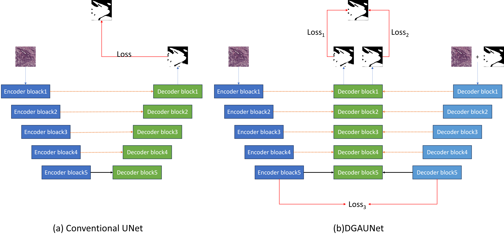
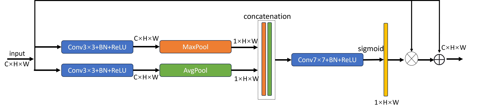

# DGAUNet dual-stream mask guided attention U-Net
Conceptual architectures comparisons between DGAUNet and conventional UNet:

DGAUNet：

The proposed attention gate for the connections between encoder and decoder：

# Environments
* Python 3.9
* Pytorch 2.2.1
* GPU RTX2080Ti
# Datasets
Here we provide our own created [GCPS](https://drive.google.com/file/d/1PPYcOj6QDtPRyXX9JVYVl_kJaXYksBI-/view?usp=drive_link)dataset for model training.
Please put the GCPS dataset as the following architecture.
```
├── data
    ├── GCPS
        ├── images
        |       ├── 0
        |           ├── 1.png
        |           ├── 2.png
        |           ├── ...
        |
        ├── masks
        |       ├── 0
        |           ├── 1.png
        |           ├── 2.png
        |           ├── ...
        |
├── src
├── train.py
├── split.py
├── ...
```
# Training
```
python DGAUNet_train.py --base_dir ./data/GCPS --train_file_dir GCPS_train.txt --val_file_dir GCPS_val.txt --base_lr 0.01 --epoch 150 --batch_size 8
```

[You can also download pre-trained models here](https://drive.google.com/file/d/1ZQG1xyhSDFzOGvRwYggFMuNc9Z4qfydd/view?usp=drive_link)

# Contact
If you have any questions about the code or data set permissions, please contact me:zhangqinghua869@gmail.com

